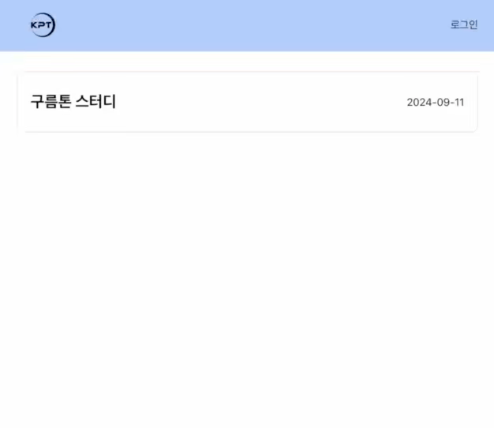

# 🌟 KPT 관리 시스템
이 프로젝트는 Keep(잘한 점), Problem(문제점), Try(시도할 점)의 약자로, 프로젝트나 작업 후 회고하는 데 사용하는 KPT를 관리하는 시스템이다. 사용자는 로그인 여부에 따라 KPT 목록과 메모를 조회하거나, 직접 KPT와 메모를 작성 및 관리할 수 있다.

  

## 💡 주요 기능
### 1. 🔐 로그인 및 회원가입
- 로그인하지 않은 상태에서도 KPT 목록과 세부 내용을 조회할 수 있다.
- 로그인을 하면 메모를 작성, 수정, 삭제할 수 있다.
- 회원가입 시에는 아이디, 비밀번호, 비밀번호 확인, 닉네임을 입력받는다.
- 이미 존재하는 아이디로는 회원가입할 수 없다.
- 회원가입에 성공하면 로그인 화면으로 이동한다.
- 로그인하지 않은 상태에서 작성 버튼을 누르면 로그인 후 이용 가능하다는 메시지가 뜬다.
  
### 2. 🗂️ KPT 목록 및 상세 보기
- KPT 목록: 로그인하지 않은 상태에서도 기존 KPT 목록을 볼 수 있다.
- KPT 세부 내용: 각 KPT를 클릭하면 'Keep', 'Problem', 'Try'로 구분된 메모들을 볼 수 있다.

### 3. 📝 메모 작성, 수정, 삭제
- 로그인한 상태에서 각 섹션(Keep, Problem, Try)에 메모를 작성할 수 있다.
- 메모 작성 시 현재 로그인한 사용자의 닉네임이 자동으로 입력된다.
- 자신이 작성한 메모만 수정 및 삭제할 수 있다.
  - 자신이 작성한 메모를 클릭하면 수정과 삭제 버튼이 나타난다.
  - 수정 버튼을 클릭해 메모를 수정할 수 있으며, 삭제 버튼을 클릭해 메모를 삭제할 수 있다.
  - 다른 사용자의 메모는 클릭해도 수정/삭제 버튼이 나타나지 않는다.

### 4. ➕ KPT 생성
- 로그인한 상태에서 헤더에 '새 KPT 작성' 버튼이 표시된다.
- KPT 제목과 날짜를 입력하여 새로운 KPT를 생성할 수 있다.
- 생성된 KPT는 메인 페이지의 KPT 목록에 추가된다.

### 5. 🚪 로그아웃
- 로그인한 상태에서 헤더에 '로그아웃' 버튼이 표시된다.
- 로그아웃 버튼을 클릭해 언제든지 로그아웃할 수 있다.

## 🛠️ 사용 기술
- React: 컴포넌트 기반의 프론트엔드 라이브러리로, UI를 효율적으로 구성하고 상태 관리를 쉽게 할 수 있다.
- Local Storage: 브라우저에 데이터를 저장하여 백엔드 없이 KPT 메모와 사용자 정보를 관리하며, 페이지 새로고침 시에도 데이터가 유지된다.
